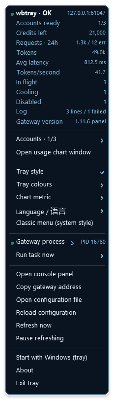

# wbtray

A tray icon for the [workbuddy2api-panel](https://github.com/linguo2625469/workbuddy2api-panel)
gateway. It shows the pool's health, credits and traffic in the Windows
notification area, lets the switches that matter be flipped without opening a
browser, and can start, stop and hide the gateway itself.

```
   wb2api  :7863   --->   /healthz, /panel/api/*   --->   wbtray
   (the gateway)                                         (this program)
```

## What the icon shows

The icon is the readout, so the answer to "is anything wrong" does not need a
click. Its **colour** is the health of the pool, and its **shape** carries
whichever metric you choose.

Each of the five styles, in both palettes, on both appearances, as the taskbar
actually draws them — 16 pixels, magnified here so the shapes are visible:


| Colour | Means |
|---|---|
| Green | accounts are serving |
| Amber | the gateway is up but nothing can serve: every account is cooling, disabled, or there are none |
| Red | the gateway cannot be reached |
| Grey | refreshing is paused |

The icon has no plate. Its mark is drawn straight onto the taskbar over a soft
halo, which is what lets it sit next to the system's own icons without a block of
colour around it:

| Style | Draws |
|---|---|
| **Ring** | the metric as a filled gauge, with a tick at the exact value |
| **Bars** | the last four buckets of its history |
| **Sparkline** | the last twelve buckets as a smoothed curve, newest point marked |
| **Mascot** | the same cat the console uses, wearing the health colour |
| **Plain** | a quiet glyph, for when the tray should be present but not loud |

Two palettes: **Neon**, which is cyan on a dark halo, and **Monochrome**, which
keeps colour for the two states that need it and is otherwise neutral. Both can
be pinned or left to follow the Windows light/dark mode, which turns the mark
inside out — dark ink on a light halo — for a light taskbar.

The metric behind the shape is one of accounts ready, credits left, requests,
tokens, average latency, tokens per second, or requests in flight, and the
numbers come from the gateway's own API rather than from a second implementation
of the same accounting.

## What the menu offers

Right-clicking the icon opens a menu that is rebuilt from live state every time,
so what it says is what is true at that moment.

- **A block of live numbers**: accounts ready, credits, requests, tokens,
  latency, throughput, in flight, cooling, disabled, log lines, gateway version.
- **The account list**, one row per account with its balance and a coloured pip
  for ready / cooling / busy / disabled.
- **The style gallery**, where every style is drawn as the icon it would produce,
  with the live numbers and theme applied. Hovering a row paints that style onto
  the real tray icon, so a choice can be tried before it is made.
- **The palette**, and whether to follow the Windows light/dark mode or pin it.
- **The metric**, the language, and which kind of menu to use.
- **The gateway process**: start, stop, restart, show or hide its console
  window, and whether it starts with Windows.
- **Maintenance actions**: check in, travel, report activity, keep tokens alive,
  refresh balances, scan the task centre, run the task queue.
- **Links**: open the console panel (with the API key already filled in), copy
  the gateway address, open the configuration file, reload it.

The menu is drawn by wbtray rather than by the shell, which is what allows
previews and a palette of its own. A system menu is one click away for a screen
reader, a locked-down desktop, or a machine where the drawn menu is simply
unwanted; both are built from the same model.


## The chart window

A sixteen-pixel icon can show a shape but not a reading. Double-clicking the icon
opens a window with the same data at a size where the trend and the individual
buckets are both legible: the hourly series, a live strip from the last minute of
readings, and the current figures for every metric at once. Click a legend entry
to change the metric, click the chart to switch between line, area and bars, or
use the arrow keys.




## Install

Download `wbtray.exe` and run it. That is the whole install.

On first run it writes `wbtray.conf` beside itself. Nothing needs to be
copied into it: the tray reads the gateway's own `config.json` for the API
key and the port, so an unpacked copy pointed at a default installation works
immediately.

```toml
base_url = http://127.0.0.1:7863   # left at the default, discovery follows the
api_key =                          # gateway's own configuration
discover = true

interval_seconds = 3               # how often the panel is read
timeout_seconds = 5

style = ring                       # ring | bar | spark | mascot | plain
metric = accounts                  # accounts | credits | requests | tokens |
                                   # latency | tps | queue
theme = neon                       # neon | mono
appearance = auto                  # auto | dark | light
lang = zh                          # zh | en
menu_style = flyout                # flyout | native

show_console = false               # start the gateway with a visible window
manage_process = true              # let the tray start and stop it
autostart = false
```

Every one of these is also reachable from the menu, which rewrites the file.

## What it does with the gateway process

The tray treats the gateway as something it **observes first and controls
second**. A gateway started by another program, by a scheduled task, or by hand
is found by walking the process table, and is reported as running without the
tray pretending it started it.

Start and stop are offered in both cases, because an operator who asks for "stop"
means it. The distinction that matters is attribution: the menu says whether the
running gateway is the tray's own process or someone else's, so a stop is never a
surprise.

The console window is a separate switch. A gateway started by a double click
shows one, because that is where its log goes; started by the tray it can be
hidden, and shown or hidden again at any time, which is what makes a log readable
while the service keeps running.

## What it deliberately does not do

The tray holds no state of its own about accounts, credits or usage. The gateway
is the single source of truth and its HTTP API is the only thing the tray reads;
there is no second accounting to disagree with the first.

It also does not edit the gateway's configuration file. Every setting it changes
goes through the panel's own API, which validates and hot-applies it, so the tray
cannot leave the gateway in a state the console would refuse.

## Build

```
go build ./cmd/wbtray
```

No third-party dependencies: the module requires nothing, and the Win32 calls are
declared in `internal/winapi`. The tray icon is drawn at run time by a small
software renderer, so there is no icon asset to install, lose or version-skew.

Useful commands while developing:

```
go test ./...                                   # everything, including the layout checks
go run ./cmd/preview -out design/styles-all.png # the sheets above, regenerated
```

The executable's own icon, the one Explorer shows, is a PE resource, and Go can
only attach one through a `.syso` beside the package's sources. That file is
generated from the same renderer the tray uses and is committed, because a release
build should not need a renderer and a generated binary in a build step is one
more thing that can differ between two machines:

```
go run ./cmd/iconbuild -arch amd64
```

## Licence

MIT.
