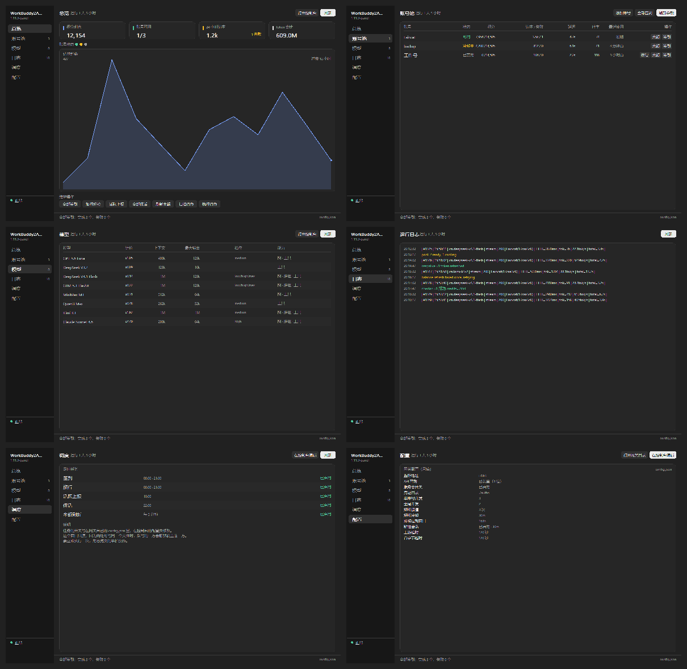
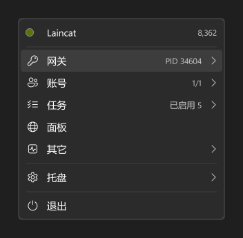
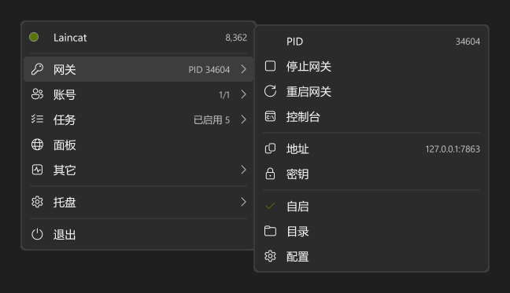
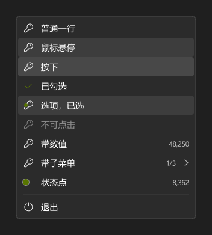

# wbtray

[workbuddy2api-panel](https://github.com/linguo2625469/workbuddy2api-panel) 网关的 Windows 托盘程序：在任务栏显示账号池的健康、积分与流量，不用开浏览器就能切换关键开关，并且能自己下载、安装、启动和更新网关。

**简体中文** | [English](README.md)

```
   wb2api  :7863   --->   /healthz, /panel/api/*   --->   wbtray
   （网关）                                            （本程序）
```

## 托盘图标显示什么

图标本身就是读数，所以"有没有出问题"这个问题不需要点开就能回答。它的**颜色**是账号池的健康状态，**形状**承载你选的那个读数。

十种形状，四套配色，两种明暗，按任务栏实际的尺寸渲染——16 像素，此处放大：


| 颜色 | 含义 |
|---|---|
| 绿 | 有账号正在服务 |
| 黄 | 网关在运行但无法服务：所有账号都在冷却、被禁用，或者根本没有账号 |
| 红 | 连不上网关 |
| 灰 | 刷新已暂停 |

图标不画底板。标记直接落在任务栏上，这样它才能和系统自己的图标并排而不带一块色块。

| 形状 | 画什么 |
|---|---|
| **圆环** | 读数作为一圈填充 |
| **柱状** | 最近四个时间桶 |
| **曲线** | 最近十二个时间桶的平滑折线，末点标记 |
| **数字** | 读数本身 |
| **猫** | 产品自己的吉祥物，穿着健康色 |
| **盾牌 / 命令 / 流线 / 节点 / 细环** | 程序图标也能穿的五个标记，让托盘和文件用同一个形状 |

### 配色

四套，每套都是一个中性灰阶的明暗两态。这套设计里颜色只留给需要被注意到的状态，其余全是墨色。


| 配色 | 中性色 |
|---|---|
| **标准** | 设计的原始灰：普通暖中性灰 |
| **冷灰** | 偏蓝的灰——黑读起来像石板而不是炭 |
| **暖灰** | 偏褐的灰，读起来像棕褐 |
| **高对比** | 拉开层次：背景更黑、卡片更亮 |

强调色是墨色而不是自有颜色，这是有意的。早先的版本穿的是 Windows 强调色——听起来是对的（图标和系统自己的图标同色），实际不是：强调色是给人当高亮用的，不是当状态标记用的。一个深橄榄色的强调色在深色任务栏上对比度只有 1.5:1，于是托盘里每个标记都是泥橄榄色，或者在加了对比度修正之后变成灰扑扑的褐色。这里的颜色是留给问题的。

测试会检查每套配色的承诺：每个墨色对它被画在其上的每个表面都可读，余量在 4.6:1 到 17.5:1 之间。

### 程序图标

可执行文件带自己的标记——那是身份而不是读数，因为资源管理器里的图标是编译时画一次的，把读数烤进去，第二天就是假的。


七个可选，在 16、32、256 像素上，浅底深底各一组。默认是猫，因为它才是这个产品自己的角色，也是七个里唯一能在文件夹里二十个图标中被认出来的。换一个：

```bash
go run ./cmd/iconbuild -variant shield   # cat、gauge、shield、prompt、waves、nodes、ring
```

16 像素下的猫**不画五官**。头部低于约四十像素时，一只眼睛只有两像素宽，两个亮点加一个鼻子不是脸而是噪点；耳朵撑起了轮廓，而轮廓才是让这个形状在任何尺寸下都读作猫的东西。


## 托盘里打开什么

右键点图标打开的是 wbtray 自己的面板，而不是系统的菜单，每次打开都按实时状态重建，所以它说的就是那一刻的真实情况。


理由在开关上。原生菜单能罗列动作，画不出开关、曲线和带颜色的数字行，而正是这些东西让面板能回答问题而不是提供命令。用位置表示的状态不需要"读"，而"暂停"和"继续"是同一行两个词，必须分辨。

| 行 | 做什么 |
|---|---|
| **顶部** | 状态色点、正在服务的账号、以及它背后的积分 |
| **趋势** | 最近十二个时间桶的请求数，是形状而不是坐标轴 |
| **指标** | 请求、延迟、吐字，各带自己的颜色 |
| **暂停刷新** | 开关，不是命令 |
| **随系统启动** | 开关，管托盘自己的自启项 |
| **打开控制台** | 主窗口，停在行上写的那一页 |
| **网关 / 账号 / 模型与日志** | 控制台，各自打开到对应页面 |
| **退出** | 退出托盘；网关继续运行 |

面板里没有任何二级菜单。需要二级菜单的行会打开控制台对应的页面，因为面板里嵌套菜单仍然是菜单，而摆脱菜单正是这件事的目的。系统的原生菜单保留为降级路径：面板窗口创建失败的机器上，托盘完全没有入口比外观不对更糟。

## 控制台

左键点图标打开主窗口。它就是网关的控制台：网页面板提供的一切，除了两件必须用浏览器的事。



| 页面 | 显示什么 |
|---|---|
| **总览** | 账号池的指标、趋势、状态点行、以及七个全局维护动作 |
| **账号池** | 每个账号一行，行内带签到、余额、恢复 |
| **模型** | 目录：每个模型的计价、上下文长度、支持的档位、能力 |
| **日志** | 网关自己的日志环，最新的在前，按频道着色 |
| **调度** | 网关五个定时任务哪些开着、什么时候跑 |
| **配置** | 网关的设置，只读 |

调度和配置两页是只读的，页面上也写明了原因。两者的开关都写在网关自己的 `config.json` 里，由网页面板写入；两个写入者会静默覆盖，输掉竞态的那一个就是操作员的改动。


## 复制行能复制什么

两个平时得自己去找的值现在都只差一次点击，放在**网关 ▸** 里——它们就是网关自己的地址和密钥，所以找它们的人自然会在那里找。

- **网关 ▸ 地址**：复制完整的网关 URL，含 `http://` 前缀。
- **网关 ▸ 密钥**：复制托盘**实际在用**的密钥——若走的是自动发现，那就是网关自己 `config.json` 里的那个。密钥不会渲染进菜单文本（一张打开菜单的截图不应该等于一份凭据），所以复制的确认气球是唯一的反馈。

没有密钥可复制时，该行是置灰的，而不是报告「复制成功」却复制了个空字符串。

## 安装与首次启动

下载 `wbtray.exe` 运行即可，这就是全部安装步骤。

首次运行会在自己旁边生成 `wbtray.conf`。不需要往里抄任何东西：托盘会读网关自己的 `config.json` 拿 API Key 和端口，所以解压到默认安装旁边就直接能用。

### 启动时按顺序做三件事

1. **已经有 `wb2api.exe` 进程在跑**（不管是谁启动的）→ 直接读它的信息，不动它。
2. **没有进程，但目录下有安装好的网关** → 启动它。
3. **两者都没有** → 自动从 GitHub 下载最新发行版（GitHub 不通则自动改用 cnb.cool 镜像），解压到 `wbtray.exe` 旁边的 `wb2api/ `目录，然后启动。

安装目录长这样：

```
wbtray/
  wbtray.exe          托盘本体
  wbtray.conf         托盘自己的设置
  wb2api/             网关（自动下载到这里）
    wb2api.exe
    config.json       网关自己的设置，首次运行自动生成
    config.example.json
    auths/            账号凭证
    data/             运行状态
```

### 添加账号

网关起来之后还不能提供服务，因为还没有账号。托盘会弹一个气泡提醒，并给出面板地址；菜单里也有「添加账号（打开面板）」。在面板里按上游说明完成 OAuth 登录（见上游 README 的「方式二：Windows 单文件运行」）。

登录完成后 `auths/` 目录会出现凭证文件，托盘会自动读到账号并开始显示。

## 更新

托盘定期（每 6 小时）检查两个项目的更新，也会在菜单里提供「立即检查」：

- **网关**：从上游最新发行版下载。更新前先停网关，替换目录时会把 `config.json`、`auths/`、`data/` 原样搬过去——**账号和设置不会丢**。更新完自动重新启动。
- **托盘自身**：下载新版本，把自己换掉并重启。Windows 不允许覆盖正在运行的 exe，但允许改名，所以做法是：把正在运行的自己改名挪开 → 把新的放进来 → 启动新的 → 本进程退出。

两个项目的下载都是 **GitHub 优先，cnb.cool 兜底**：任何一步 GitHub 不通就自动改用镜像，不需要你手动切。

## cnb.cool 镜像

https://cnb.cool/laincat/wbtray 是 GitHub 的镜像，**不参与构建**：

- 每小时从 GitHub 拉取全部分支与标签（也可以在仓库页面按「立即同步」按钮，或调 API 触发）。
- 有版本 tag 时，把该 tag 在 GitHub 上发布的附件原样搬运过来，**不重新编译**——所以两个站点的文件逐字节相同。
- 同一个发行版里还带上 **workbuddy2api-panel 的 Windows 构建**，这样只要一个镜像就能拿到两个程序；上游项目自己没有 cnb.cool 仓库，GitHub 不通的人否则根本拿不到网关。

## 配置

```toml
base_url = http://127.0.0.1:7863   # 保持默认时，端口由网关自己的配置发现
api_key =                          # 空则读网关自己的 config.json
discover = true

interval_seconds = 3               # 读取面板的间隔
timeout_seconds = 5

style = ring          # ring | bar | spark | mascot | plain | bartext | text | mascottext
metric = accounts                  # accounts | credits | requests | tokens |
                                   # latency | tps | queue
theme = system                     # system | mono
appearance = auto                  # auto | dark | light
lang = zh                          # zh | en

show_console = false               # 启动网关时是否带控制台窗口
manage_process = true              # 允许托盘启停网关
autostart = false
```

以上每一项都能在菜单里改，菜单会写回这个文件。

## 关于网关进程的取舍

托盘把网关当作**先观察、后控制**的对象。由别的程序、计划任务或手动启动的网关会被进程表找到并如实报告，托盘不会假装是自己启动的。

启停对两种情况都提供——操作者说「停止」就是要停止。真正重要的区别只有归属：菜单会标明正在跑的网关是托盘自己的还是别人的，所以停止永远不会是个意外。

控制台窗口是独立开关。双击启动的网关带窗口，因为日志在那里；托盘启动的可以隐藏，运行中也能随时显示或隐藏——服务不停，日志照样看。

## 它有意不做的事

托盘不自持任何账号、积分、用量状态。网关是唯一事实来源，托盘只读它的 HTTP API，不存在第二套会跟第一套对不上的账。

它也不直接改网关的配置文件。所有设置都走面板自己的 API，由那边校验并热应用，所以托盘不可能把网关弄成控制台会拒绝的状态。

## 构建

```
go build ./cmd/wbtray
```

零第三方依赖：模块不 require 任何东西，Win32 调用声明在 `internal/winapi`。托盘图标是运行期由一个小型软件渲染器画出来的，没有图标资源需要安装、丢失或版本错配。

开发时常用的命令：

```
go test ./...                                    # 全部测试，含排版检查
go run ./cmd/preview -out design/styles-all.png  # 重新生成上面的图
```

## Windows 11 菜单考察

托盘现在开的是系统原生菜单。`cmd/uidemo` 画出它按 Windows 11 设计语言重做后的样子——圆角表面、发丝边框、Fluent 图标、系统自己的字体与强调色——这样「要不要做成这样」靠看就能回答，不用靠想象。它是开发工具，不属于程序本体。

```
go run ./cmd/uidemo                         # 中英各一张，暗色
go run ./cmd/uidemo -scene submenu          # 子菜单叠在父菜单上
go run ./cmd/uidemo -scene states           # 每一行状态各画一次
go run ./cmd/uidemo -dark=false             # 亮色
go run ./cmd/uidemo -accent '#c30052'       # 指定强调色
```

它读的是 Windows 当前的强调色和系统 UI 字体，所以画出来的是这台机器的样子，不是概念图。每个场景中英各出一张——两种语言几乎每行长度都不同，在一种语言里成立不等于成立。

这次考察得到的三条结论，以及各自的代价：

- **表面很便宜。** 圆角和发丝边框来自托盘本来就有的图标渲染器，超采样绘制后缩小即可。自绘菜单对体积几乎没有增加——此前存在过的那个自绘菜单，比它替换掉的系统菜单还**小 0.04 MB**，因为那套渲染器两种做法下都要在。
- **文字不便宜。** 中文和图标字形需要一个光栅化器，而托盘已经没有它了：需要它的那个窗口随曲线窗口一起删掉了。`cmd/uidemo` 里带了一个最小实现，它的体量就是对这部分代价最诚实的估计。
- **Mica 与自绘内容不能共存。** 半透明材质是窗口背后的合成器效果，自己画背景的窗口会把它盖住。这一条是实测的：各种 backdrop 属性全部被系统接受，但没有一种能透出来。自绘菜单能拿到的是圆角和边框。







exe 自己的图标（资源管理器里看到的那个）是 PE 资源，Go 只能通过放在包目录旁的 `.syso` 附加。该文件由同一个渲染器生成并已提交，因为发布构建不应该依赖渲染器，而构建步骤里多一个生成的二进制产物就多一处两台机器可能不一致的地方：

```
go run ./cmd/iconbuild -arch amd64
```

## 许可证

MIT。
