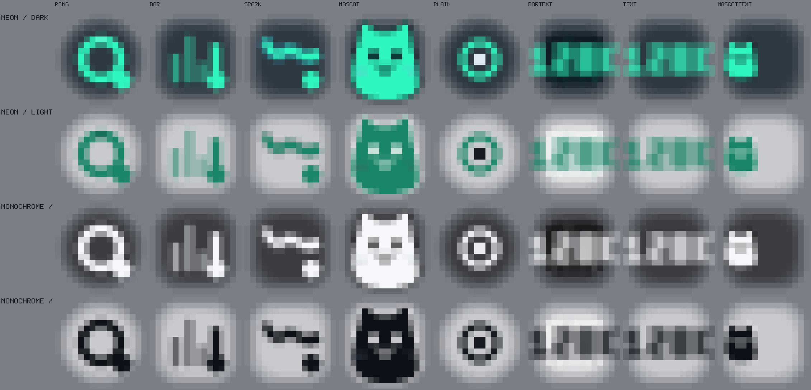
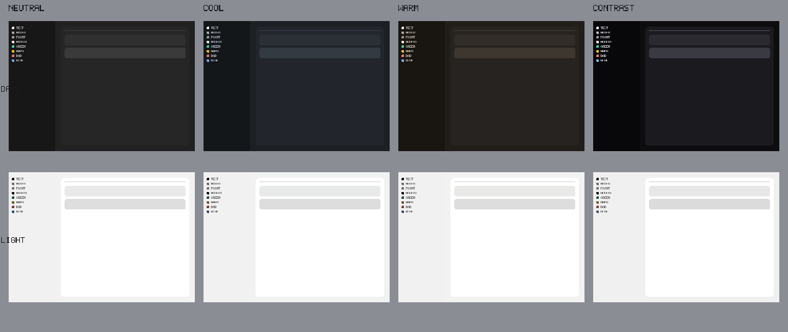
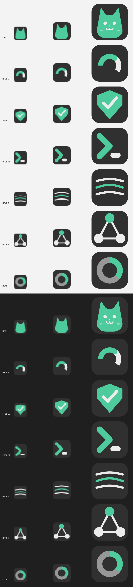
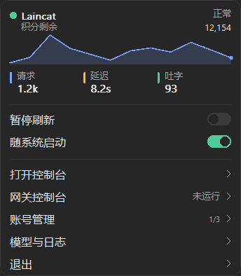
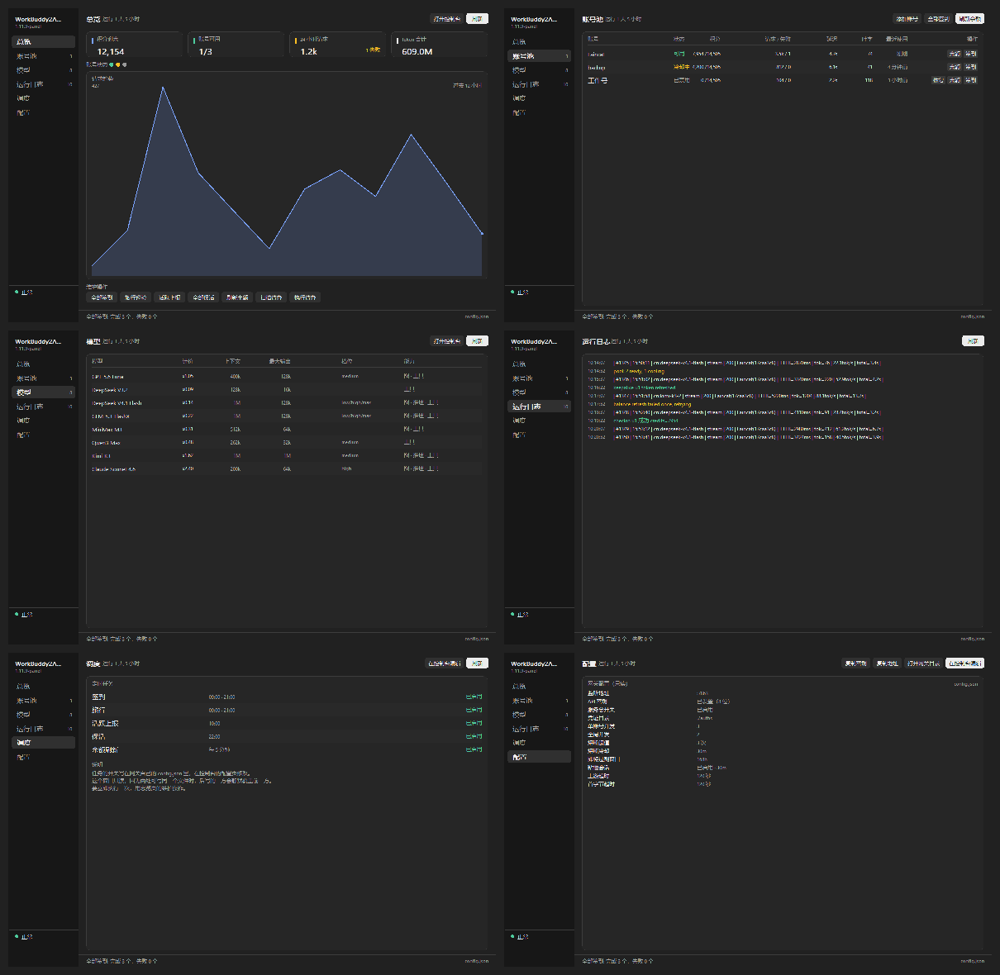

# wbtray

[workbuddy2api-panel](https://github.com/linguo2625469/workbuddy2api-panel) 网关的 Windows 托盘程序。它常驻通知区域，在那里显示账号池的健康与流量，并且能自己下载、安装、启动、停止和更新网关——网关不必再由你手动下载、手动保活，也不必开一个浏览器盯着。

**简体中文** | [English](README.md)

```
   wb2api  :7863   --->   /healthz, /panel/api/*   --->   wbtray
   （网关）                                            （本程序）
```

网关是唯一事实来源，托盘不自持任何副本：每一个数字都来自网关自己的 HTTP API，两者不可能对同一条数据给出两个答案，也不存在第二套账本和第一套对不上。

## 安装

下载 `wbtray.exe` 运行即可，这就是全部安装步骤：不需要运行库、不需要安装程序、没有资源文件。整个程序是一个单文件，没有任何第三方依赖；它画出的一切——托盘图标、面板、控制台、以及可执行文件自己的图标——都是运行时绘制的。

首次运行会在自己旁边生成 `wbtray.conf`，指向 `127.0.0.1:7863` 上的网关。不需要往里抄任何东西：托盘会读网关自己的 `config.json` 拿 API Key 和端口，所以解压到已有网关旁边就能直接用。

### 启动时按顺序做三件事

1. **已经有 `wb2api.exe` 进程在跑**（不管是谁启动的）→ 读取它的信息，不动它。
2. **没有进程，但目录下有安装好的网关** → 启动它。
3. **两者都没有** → 自动下载最新发行版（GitHub 不通则自动改用 cnb.cool 镜像），解压到 `wbtray.exe` 旁边的 `wb2api/`，然后启动。

启动之后，托盘会等网关的 API 真正应答再开始汇报。刚启动的进程不等于就绪的网关，而每次启动都先报三秒「离线」看起来像故障，不像启动过程。

安装目录长这样：

```
wbtray/
  wbtray.exe          托盘本体
  wbtray.conf         托盘自己的设置
  wb2api/             网关（自动下载到这里）
    wb2api.exe
    config.json       网关自己的设置，首次运行自动生成
    config.example.json
    auths/            账号凭证
    data/             运行状态
```

### 添加账号

网关刚起来还不能提供服务，因为还没有账号。托盘会弹一个气泡提醒，控制台的账号池页也有打开网页面板的入口。在面板里按上游说明完成登录，凭证会出现在 `auths/`，托盘随即读到账号并开始显示。

## 托盘图标

图标本身就是读数而不是徽标，所以「有没有出问题」不需要点开就能回答。它的**颜色**是账号池的健康状态，**形状**承载你选的那个读数。

十种形状，四套配色，两种明暗，按任务栏实际的尺寸渲染——16 像素，此处放大：



| 颜色 | 含义 |
|---|---|
| 绿 | 有账号正在服务 |
| 黄 | 网关在运行但无法服务：所有账号都在冷却、被禁用，或者根本没有账号 |
| 红 | 连不上网关 |
| 灰 | 刷新已暂停 |

图标不画底板，这是量出来的结论而不是偏好：托盘图标是和系统自己的图标并排的，那些都是裸字形。早先的版本在标记后面画过一个半透明圆角方块，结果在深色任务栏上恰好就是它想避免的那块色斑。可读性改由配色保证：每个标记用的墨色，配色都已经针对它将被读到的那条任务栏验算过了。

| 形状 | 画什么 |
|---|---|
| **圆环** | 读数作为一圈填充 |
| **柱状** | 最近四个时间桶 |
| **曲线** | 最近十二个时间桶的平滑折线，末点标记 |
| **数字** | 读数本身 |
| **猫** | 产品自己的吉祥物，穿着健康色 |
| **盾牌 / 命令 / 流线 / 节点 / 细环** | 程序图标也能穿的五个标记，让托盘和文件用同一个形状 |

### 配色

四套，每套都是一个中性灰阶的明暗两态。这套设计里颜色只留给需要被注意到的状态，其余全是墨色。



| 配色 | 中性色 |
|---|---|
| **标准** | 设计的原始灰：普通暖中性灰 |
| **冷灰** | 偏蓝的灰——黑读起来像石板而不是炭 |
| **暖灰** | 偏褐的灰，读起来像棕褐 |
| **高对比** | 拉开层次：背景更黑、卡片更亮 |

强调色是墨色而不是自有颜色，这是有意的。早先的版本穿的是 Windows 强调色——听起来是对的（图标和系统自己的图标同色），实际不是：强调色是给人当高亮用的，不是当状态标记用的。一个深橄榄色的强调色在深色任务栏上对比度只有 1.5:1，于是托盘里每个标记都是泥橄榄色，或者在加了对比度修正之后变成灰扑扑的褐色。这里的颜色是留给问题的。

测试会检查每套配色的承诺：每个墨色对它被画在其上的每个表面都可读，余量在 4.6:1 到 17.5:1 之间。

### 程序图标

可执行文件带自己的标记——那是身份而不是读数，因为资源管理器里的图标是编译时画一次的，把读数烤进去，第二天就是假的。



七个可选，在 16、32、256 像素上，浅底深底各一组。默认是猫，因为它才是这个产品自己的角色，也是七个里唯一能在文件夹里二十个图标中被认出来的。换一个：

```
go run ./cmd/iconbuild -variant shield   # cat、gauge、shield、prompt、waves、nodes、ring
```

16 像素下的猫**不画五官**。头部低于约四十像素时，一只眼睛只有两像素宽，两个亮点加一个鼻子不是脸而是噪点；耳朵撑起了轮廓，而轮廓才是让这个形状在任何尺寸下都读作猫的东西。

## 面板与控制台

**左键**打开控制台（主窗口，停在上次那一页）。**右键**打开面板——那是 wbtray 自己画的卡片，不是系统的菜单。



做成自绘面板的理由在开关上。原生菜单能罗列动作，画不出开关、曲线和带颜色的数字行，而正是这些东西让面板能回答问题而不是提供命令。用位置表示的状态不需要「读」，而「暂停」和「继续」是同一行两个词，必须分辨。

| 行 | 做什么 |
|---|---|
| **顶部** | 状态色点、正在服务的账号、以及它背后的积分 |
| **趋势** | 最近十二个时间桶的请求数，是形状而不是坐标轴 |
| **指标** | 请求、延迟、吐字，各带自己的颜色 |
| **暂停刷新** | 开关，不是命令 |
| **随系统启动** | 开关，管托盘自己的自启项 |
| **打开控制台** | 主窗口，停在行上写的那一页 |
| **网关 / 账号 / 模型与日志** | 控制台，各自打开到对应页面 |
| **退出** | 退出托盘；网关继续运行 |

面板里没有任何二级菜单。需要二级菜单的行会打开控制台对应的页面，因为面板里嵌套菜单仍然是菜单，而摆脱菜单正是这件事的目的。

系统的原生菜单仍然保留为降级路径，供面板无法创建的机器使用——托盘完全没有入口，比入口外观不对更糟。它是经典系统菜单：顶层九行、两字标签，承载网关的进程控制、账号、维护任务、外观设置和更新。

控制台就是主窗口：网页面板提供的一切，收在一条导航栏后面的六个页面里。



| 页面 | 显示什么 |
|---|---|
| **总览** | 账号池的指标、趋势、状态点行、以及七个全局维护动作 |
| **账号池** | 每个账号一行，行内带签到、余额、恢复 |
| **模型** | 目录：每个模型的计价、上下文长度、支持的档位、能力 |
| **日志** | 网关自己的日志环，最新的在前，按频道着色 |
| **调度** | 网关五个定时任务哪些开着、什么时候跑 |
| **配置** | 网关的设置，只读 |

调度和配置两页是只读的，页面上也写明了原因。两者的开关都写在网关自己的 `config.json` 里，由网页面板写入；两个写入者会静默覆盖，输掉竞态的那一个就是操作员的改动。

### 复制地址与密钥

两个否则需要操作员自己去找的值，都在控制台的配置页上一键可得。

- **复制地址** 把完整的网关 URL 放进剪贴板，含协议头。
- **复制密钥** 放进的是托盘实际正在用的那个密钥——对于自动发现的网关，就是它自己 `config.json` 里的那个。

密钥是被复制而不是被显示：带凭证的窗口迟早会进截图，而这件事做成按钮的全部理由，就是它不该让人从屏幕上抄。还没读到密钥的网关会直说，而不是报一句「复制成功」然后放进一个空串。写入直接走 Win32 剪贴板 API，不经 `cmd /c clip`，所以既不会弹出控制台窗口，也不依赖当前目录或 `PATH`。

## 语言

菜单、面板、控制台三处都是双语的——**中文和英文**——开关在托盘的设置块里，或配置文件里的 `lang`。一帧画面只用一种语言绘制，文案全部来自同一张表；有一条测试断言「英文画面里不含中文」，因为它要防的正是已经发生过的那件事：菜单翻译了、窗口没翻译，而看起来像什么都没错。

## 配置

```toml
base_url = http://127.0.0.1:7863   # 保持默认时，端口由网关自己的配置发现
api_key =                          # 空则读网关自己的 config.json
discover = true

interval_seconds = 3               # 读取面板的间隔
timeout_seconds = 5

style = gauge         # gauge | bars | spark | number | cat
                      # shield | prompt | waves | nodes | ring
metric = accounts     # accounts | credits | requests | tokens | latency | tps | queue
theme = neutral       # neutral | cool | warm | contrast
appearance = auto     # auto | dark | light
app_icon = cat        # cat | gauge | shield | prompt | waves | nodes | ring
                      # 图标在编译时写入，选中后下次构建生效
lang = zh             # zh | en

show_console = false               # 启动网关时是否带控制台窗口
manage_process = true              # 允许托盘启停网关
autostart = false
```

配置文件优先写在 `wbtray.exe` 旁边，该目录不可写时写到 `%APPDATA%\wbtray\`——装在 `Program Files` 下的情形就是这个判断存在的原因。

以上每一项都能在菜单、面板和控制台里改，它们会写回这个文件。`app_icon` 是唯一的例外：图标是编译时写入的 PE 资源，所以那里选的是记下来、由下一次构建读取。

## 更新

托盘每 6 小时检查两个项目的版本，菜单里也可以立即检查：

- **网关**：从上游最新发行版下载。更新前先停网关，替换目录时会把 `config.json`、`auths/`、`data/` 原样搬过去——**账号和设置不会丢**。更新完自动重新启动。
- **托盘自身**：下载新版本，把自己换掉并重启。Windows 不允许覆盖正在运行的 exe，但允许改名，所以做法是：把正在运行的自己改名挪开 → 把新的放进来 → 启动新的 → 本进程退出。被改名的旧文件在下次启动时删除，那是没有任何东西还占着它的第一个时刻。

两个项目的下载都是 **GitHub 优先，cnb.cool 兜底**：任何一步 GitHub 不通就自动改用镜像，不需要你手动切。

## cnb.cool 镜像

https://cnb.cool/laincat/wbtray 是 GitHub 的镜像，**不参与构建**：

- **每 6 小时**从 GitHub 拉取全部分支与标签（也可以在仓库页面按「立即同步」按钮，或调 API 触发）。这个间隔是配额决定的：CNB 按 5 分钟一块计费，无论实际跑多久，而免费额度是和发布任务共用的。每小时跑一次会把额度耗光，症状是镜像**悄悄不再产出发布**——构建停在 Prepare 阶段报「CPU 核时不够预冻结」，于是什么都没有发布，而镜像同步本身不会报告这件事。
- 有版本 tag 时，把该 tag 在 GitHub 上发布的附件原样搬运过来，**不重新编译**——所以两个站点的文件逐字节相同。任务会重试二十分钟，因为 tag 和它的附件在对面不是同时到达的，而一次 404 就失败的任务不会再为这个 tag 跑第二次。
- 同一个发行版里还带上 **workbuddy2api-panel 的 Windows 构建**，这样只要一个镜像就能拿到两个程序；上游项目自己没有 cnb.cool 仓库，GitHub 不通的人否则根本拿不到网关。它的版本记在 `workbuddy2api-panel-version.txt` 里，因为镜像副本的文件名是固定的，装不下版本号。

## 关于网关进程的取舍

托盘把网关当作**先观察、后控制**的对象。由别的程序、计划任务或手动启动的网关会被进程表找到并如实报告，托盘不会假装是自己启动的。

启动、停止、重启对两种情况都提供——操作者说「停止」就是要停止。真正重要的区别只有归属：菜单会标明正在跑的网关是托盘自己的还是别人的，所以停止永远不会是个意外。

控制台窗口是独立开关。双击启动的网关带窗口，因为日志在那里；托盘启动的可以隐藏，运行中也能随时显示或隐藏——服务不停，日志照样看。启动时用的是它自己的控制台，而不是一个没有窗口的分离进程，因为没有控制台的进程事后拿不到控制台，那个开关在结构上就不可能工作。

## 它有意不做的事

托盘不直接改网关的配置文件。所有设置都走面板自己的 API，由那边校验并热应用，所以托盘不可能把网关弄成控制台会拒绝的状态。

## 构建

```
go build ./cmd/wbtray
```

零第三方依赖：`go.mod` 什么都不引入，Win32 调用都声明在 `internal/winapi` 里。文字交给 Windows 自己的字体（走 GDI），因为那是程序该向系统要、而不是自己画的东西；其余每一个形状都由一个小的软件渲染器绘制，所以没有资源文件需要安装、丢失或者版本错配。

开发时的常用命令：

```
go test ./...                                      # 全部测试，含布局检查
go run ./cmd/iconsheet  -out design/appmarks.png   # 程序图标
go run ./cmd/themesheet -out design/themes.png     # 四套配色、明暗两态
go run ./cmd/preview    -out design/styles-all.png # 全部形状、配色、明暗与状态
go run ./cmd/uipreview  -out design/console-zh.png -tab all -lang en
go run ./cmd/uipreview  -out design/panel-zh.png   -tab tray -lang zh
go run ./cmd/iconbuild  -variant cat               # 重新生成 .syso
```

`cmd/palettecheck` 打印本机解析出的配色，并检查每个墨色对它被画在其上的每个表面。这些都不是程序的一部分。

### 可执行文件的图标

它是 PE 资源，而 Go 只能通过包源码旁的 `.syso` 附上一个。那个文件由托盘用的同一个渲染器生成并提交进仓库，因为发布构建不该需要一个渲染器，而构建步骤里的生成产物正是两台机器之间会不一致的东西之一。

构建会检查结果而不是相信过程：链接器丢掉的资源段，或者 256×256 以下 Windows 不接受的图像格式，产出的可执行文件能编译、能运行，然后安静地显示系统通用图标。发布任务会像 Windows 那样读一遍构建出来的文件，所以这种情况会在构建阶段失败，而不是发出去。

## 许可证

MIT。

