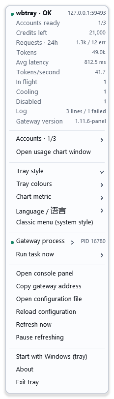
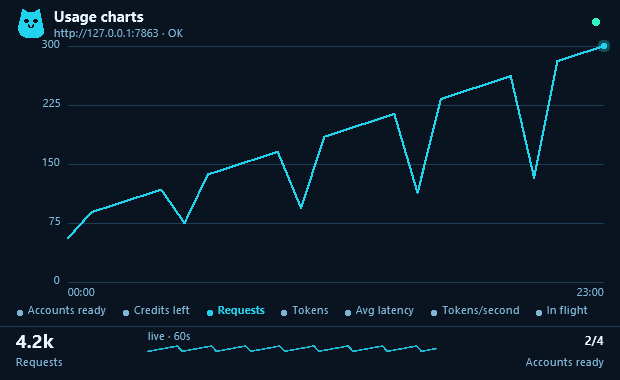

# wbtray

[workbuddy2api-panel](https://github.com/linguo2625469/workbuddy2api-panel) 网关的 Windows 托盘程序：在任务栏显示账号池的健康、积分与流量，不用开浏览器就能切换关键开关，并且能自己下载、安装、启动和更新网关。

**简体中文** | [English](README.md)

```
   wb2api  :7863   --->   /healthz, /panel/api/*   --->   wbtray
   （网关）                                            （本程序）
```

## 托盘图标显示什么

图标本身就是读数，所以判断“有没有问题”不需要点开。**颜色**代表账号池健康度，**形状**代表你选择的指标。

五种风格、两套配色、明暗两档，都是任务栏实际大小（16 像素）放大后的样子：


| 颜色 | 含义 |
|---|---|
| 绿 | 有账号可服务 |
| 黄 | 网关在线但没有可服务的账号：全部冷却、全部禁用，或一个账号都没有 |
| 红 | 连不上网关 |
| 灰 | 刷新已暂停 |

图标没有底板，图形直接画在任务栏上，下面垫一层柔和光晕——所以它能和系统自己的图标并排，不会多出一块颜色。

| 风格 | 画什么 |
|---|---|
| **圆环** | 指标作为填充量表，并在确切数值处画一个刻度 |
| **柱状** | 最近四个时段 |
| **曲线** | 最近十二个时段平滑后的折线，末端有点 |
| **猫猫** | 和面板同一个猫，穿健康度的颜色 |
| **极简** | 安静的小图形，适合希望托盘存在但不显眼的时候 |

两套配色：**霓虹**（青色 + 深色光晕）和**单色**（除了需要颜色的两个状态，其余都是中性）。两者都可以固定，也可以跟随 Windows 明暗模式——跟随模式下，浅色任务栏会把图形翻成深色墨 + 浅色光晕。

图形背后的指标可以是：就绪账号数、剩余积分、请求数、Token 数、平均延迟、吐字速率、在途请求。这些数字全部来自网关自己的 API，不是另做一套统计。

## 菜单提供什么

右键图标打开菜单，每次都是从实时状态重新构建的，所以菜单上写的当下就是真的。

- **一组实时数字**：就绪账号、积分、请求、Token、延迟、吐字速率、在途、冷却、禁用、日志行数、网关版本。
- **账号列表**：每个账号一行，显示余额和一个颜色小点（就绪 / 冷却 / 忙 / 禁用）。
- **风格画廊**：每种风格都画成它会生成的那个图标，并用当前数字和配色渲染。**鼠标悬停某一行，真实托盘图标就会立刻变成那个样式**，看中了再点。
- **配色**，以及跟随 Windows 明暗还是固定。
- **指标**、语言、菜单类型。
- **网关进程**：启动 / 停止 / 重启 / 显示或隐藏控制台窗口 / 是否随系统启动。
- **版本与更新**：已安装版本、可用版本、一键更新网关、一键更新托盘自身。
- **维护动作**：签到、旅行、上报活跃、保活 Token、刷新余额、扫描任务中心、执行任务队列。
- **链接**：打开控制台面板（API Key 已带上）、复制网关地址、打开配置文件、重新载入。

菜单是 wbtray 自绘的，这样才能有预览和自定义配色。系统原生菜单一键可切，适合读屏软件、受限桌面，或者只是不想要自绘菜单的机器——两者由同一份模型构建。



## 曲线窗口

16 像素只能表达形状、表达不了读数。双击图标打开一个窗口，同一批数据放大到能看清趋势和每个时段：小时级序列、最近一分钟的实时波形，以及全部指标的当前数值。点图例切指标，点图表切曲线 / 面积 / 柱状，方向键也可以。



## 安装与首次启动

下载 ${q}wbtray.exe${q} 运行即可，这就是全部安装步骤。

首次运行会在自己旁边生成 ${q}wbtray.conf${q}。不需要往里抄任何东西：托盘会读网关自己的 ${q}config.json${q} 拿 API Key 和端口，所以解压到默认安装旁边就直接能用。

### 启动时按顺序做三件事

1. **已经有 ${q}wb2api.exe${q} 进程在跑**（不管是谁启动的）→ 直接读它的信息，不动它。
2. **没有进程，但目录下有安装好的网关** → 启动它。
3. **两者都没有** → 自动从 GitHub 下载最新发行版（GitHub 不通则自动改用 cnb.cool 镜像），解压到 ${q}wbtray.exe${q} 旁边的 ${q}wb2api/ ${q}目录，然后启动。

安装目录长这样：

```
wbtray/
  wbtray.exe          托盘本体
  wbtray.conf         托盘自己的设置
  wb2api/             网关（自动下载到这里）
    wb2api.exe
    config.json       网关自己的设置，首次运行自动生成
    config.example.json
    auths/            账号凭证
    data/             运行状态
```

### 添加账号

网关起来之后还不能提供服务，因为还没有账号。托盘会弹一个气泡提醒，并给出面板地址；菜单里也有「添加账号（打开面板）」。在面板里按上游说明完成 OAuth 登录（见上游 README 的「方式二：Windows 单文件运行」）。

登录完成后 ${q}auths/${q} 目录会出现凭证文件，托盘会自动读到账号并开始显示。

## 更新

托盘定期（每 6 小时）检查两个项目的更新，也会在菜单里提供「立即检查」：

- **网关**：从上游最新发行版下载。更新前先停网关，替换目录时会把 ${q}config.json${q}、${q}auths/${q}、${q}data/${q} 原样搬过去——**账号和设置不会丢**。更新完自动重新启动。
- **托盘自身**：下载新版本，把自己换掉并重启。Windows 不允许覆盖正在运行的 exe，但允许改名，所以做法是：把正在运行的自己改名挪开 → 把新的放进来 → 启动新的 → 本进程退出。

两个项目的下载都是 **GitHub 优先，cnb.cool 兜底**：任何一步 GitHub 不通就自动改用镜像，不需要你手动切。

## cnb.cool 镜像

https://cnb.cool/laincat/wbtray 是 GitHub 的镜像，**不参与构建**：

- 每小时从 GitHub 拉取全部分支与标签（也可以在仓库页面按「立即同步」按钮，或调 API 触发）。
- 有版本 tag 时，把该 tag 在 GitHub 上发布的附件原样搬运过来，**不重新编译**——所以两个站点的文件逐字节相同。
- 同一个发行版里还带上 **workbuddy2api-panel 的 Windows 构建**，这样只要一个镜像就能拿到两个程序；上游项目自己没有 cnb.cool 仓库，GitHub 不通的人否则根本拿不到网关。

## 配置

```toml
base_url = http://127.0.0.1:7863   # 保持默认时，端口由网关自己的配置发现
api_key =                          # 空则读网关自己的 config.json
discover = true

interval_seconds = 3               # 读取面板的间隔
timeout_seconds = 5

style = ring                       # ring | bar | spark | mascot | plain
metric = accounts                  # accounts | credits | requests | tokens |
                                   # latency | tps | queue
theme = neon                       # neon | mono
appearance = auto                  # auto | dark | light
lang = zh                          # zh | en
menu_style = flyout                # flyout | native

show_console = false               # 启动网关时是否带控制台窗口
manage_process = true              # 允许托盘启停网关
autostart = false
```

以上每一项都能在菜单里改，菜单会写回这个文件。

## 关于网关进程的取舍

托盘把网关当作**先观察、后控制**的对象。由别的程序、计划任务或手动启动的网关会被进程表找到并如实报告，托盘不会假装是自己启动的。

启停对两种情况都提供——操作者说「停止」就是要停止。真正重要的区别只有归属：菜单会标明正在跑的网关是托盘自己的还是别人的，所以停止永远不会是个意外。

控制台窗口是独立开关。双击启动的网关带窗口，因为日志在那里；托盘启动的可以隐藏，运行中也能随时显示或隐藏——服务不停，日志照样看。

## 它有意不做的事

托盘不自持任何账号、积分、用量状态。网关是唯一事实来源，托盘只读它的 HTTP API，不存在第二套会跟第一套对不上的账。

它也不直接改网关的配置文件。所有设置都走面板自己的 API，由那边校验并热应用，所以托盘不可能把网关弄成控制台会拒绝的状态。

## 构建

```
go build ./cmd/wbtray
```

零第三方依赖：模块不 require 任何东西，Win32 调用声明在 ${q}internal/winapi${q}。托盘图标是运行期由一个小型软件渲染器画出来的，没有图标资源需要安装、丢失或版本错配。

开发时常用的命令：

```
go test ./...                                    # 全部测试，含排版检查
go run ./cmd/preview -out design/styles-all.png  # 重新生成上面的图
```

exe 自己的图标（资源管理器里看到的那个）是 PE 资源，Go 只能通过放在包目录旁的 ${q}.syso${q} 附加。该文件由同一个渲染器生成并已提交，因为发布构建不应该依赖渲染器，而构建步骤里多一个生成的二进制产物就多一处两台机器可能不一致的地方：

```
go run ./cmd/iconbuild -arch amd64
```

## 许可证

MIT。

